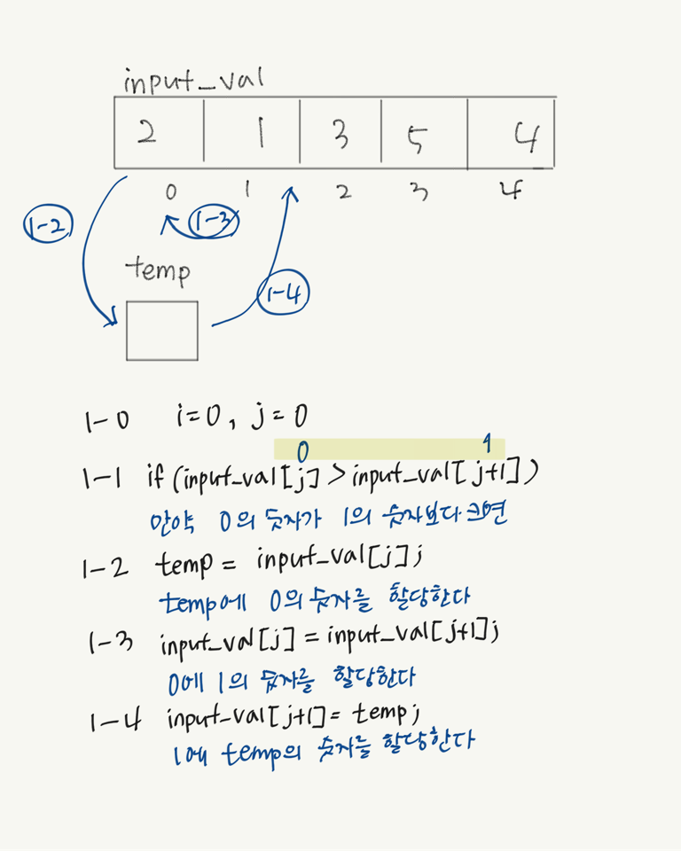

규정상 문제 공개는 불가능하지만, 작성한 답안이 아까워 올린다

```c
#include <stdio.h>

int main(void)
{
    printf("Anagram finder\n");
    printf("input(5):");
    // 입력값을 받는다.
    int input_val[5];
    for (int i=0; i<5; i++)
    {
        scanf("%1d", &input_val[i]);
    }

    // bubble sort
    int temp;
    for (int i=0; i<5; i++)
    {
        for (int j=0; j<5-i-1; j++)
        {
            if(input_val[j]>input_val[j+1])
            {
                temp=input_val[j];
                input_val[j]=input_val[j+1];
                input_val[j+1]=temp;
            }
        }
    }
    //input_val의 경우와 동일
    printf("input2(5):");
    int input_val2[5];
     for (int i=0; i<5; i++)
    {
        scanf("%1d", &input_val2[i]);
    }
    for (int i=0; i<5; i++)
    {
        for (int j=0; j<5-i-1; j++)
        {
            // printf("i input_val2[%d]=%d j input_val2[%d]=%d", i, input_val2[i], j, input_val2[j])
            if(input_val2[j]>input_val2[j+1])
            {
                temp=input_val2[j];
                input_val2[j]=input_val2[j+1];
                input_val2[j+1]=temp;
            }
        }
    }


    int output_val[5];
    for (int i = 0; i<5; i++)
    {
        output_val[i]=input_val[i]-input_val2[i];
        //두 배열의 차이(감산)를 output_val에 저장한다.
    }

    //5개의 output_val을 체크해서 0 아닌 것이 있는지 체크한다.
    int equal =1;
    for (int i=0; i<5; i++)
    {
        if (output_val[i]!=0)
        {
            equal = 0;
        }
    }

    if (equal==1)
    {
        printf("일치\n");
    }
    else if (equal==0)
    {
        printf("불일치\n");
    }
}
```

## `scanf`
이 함수를 사용하면 사용자에게서 직접 값을 입력 받을 수 있다.
```
printf("input(5):");
    int input_val[5];
    for (int i=0; i<5; i++)
    {
        scanf("%1d", &input_val[i]);
    }
```

한줄 씩 코드를 살펴보자.

```
printf("input(5):");
```
먼저 사용자에게 5자리의 숫자를 입력하는 지시문을 print한다.

```
int input_val[5];
```
`input_val`은 5개의 정수값을 갖는 변수이다.

```
for (int i=0; i<5; i++)
    {
        scanf("%1d", &input_val[i]);
    }
```
`<for>`문. 루프를 만든다. i=0을 시작으로, 1회 작동 시마다 i를 1씩 더해가며 i가 5보다 작을 때까지만 반복한다. (즉, 5회 루프한다.)

`scanf(A,&B)`에서 A에는 서식을, &B에는 할당 주소(저장 위치)를 의미한다.  
이 경우, 앞서 정의해준 `input_val`변수에 저장해준다.  
A의 `%d`는 Decimal number즉 10진수를 의미하고, 말 그대로 부호를 가진 10진수로 표현해준다.

그런데 `%1d`는 무슨 의미일까?  
입력받은 정수의 1자리만을 저장한다는 저장한다는 것이다.
- 그래서 이 부분이 루프로써 의미를 갖는데, 입력받은 5자리 숫자 중 하나의 숫자만을 `input_val`에 저장하므로, 저장되지 않은 남은 숫자를 계속해서 변수에 보내주는 것이다.  
<br>
<br>
<br>

```c
int temp;
    for (int i=0; i<5; i++)
    {
        for (int j=0; j<5-i-1; j++)
        {
            if(input_val[j]>input_val[j+1])
            {
                temp=input_val[j];
                input_val[j]=input_val[j+1];
                input_val[j+1]=temp;
            }
        }
```
이 부분은 버블정렬을 위한 코드이다.   
버블정렬은 인접한 두 배열을 비교하여 정렬하는 방법인데, 위 코드를 그림으로 간략하게 표현하면 다음과 같다.


temp는 변수 이름으로, 임시저장이라는 의미로 지은 것이다.   
직접 switch할 수 있는 방법이 없으므로 임시저장소를 이용해 변수를 한칸씩 이동하는 방법을 선택한다.   

위 코드에서, 외부 루프가 n회 반복하는 동안 내부루프는 n-1회 반복하게 되는데,  
이 부분에 대한 설명이 잘 되어있는 [블로그](https://m.blog.naver.com/tipsware/221297715324)를 링크한다.   
<br>
<br>

```c
int output_val[5];
    for (int i = 0; i<5; i++)
    {
        output_val[i]=input_val[i]-input_val2[i];
        //두 배열의 차이(감산)를 output_val에 저장한다.
    }
```
새로운 변수 `output_val`에 정렬이 완료된 변수값을 하나씩 비교해 감산(빼기)하여 저장해준다.
두 정렬이 같다면 `output_val`에 저장된 값은 모두 0이여야 할 것이다.   

```c
int equal =1;
    for (int i=0; i<5; i++)
    {
        if (output_val[i]!=0)
        {
            equal = 0;
        }
    }
```
함수 `equal`은 값 1을 갖고 있는데, 만약 `output_val`에 0이 아닌 수가 저장되어있다면 그 값을 0으로 치환한다.  
```c
if (equal==1)
    {
        printf("일치\n");
    }
    else if (equal==0)
    {
        printf("불일치\n");
    }
```
`equal`의 값이 치환되지 않아 1이면 "일치"를, 치환되어 0의 값을 가지고 있다면 "불일치"를 출력한다.
