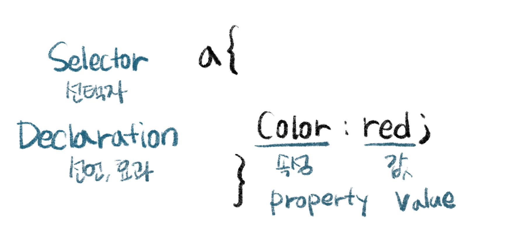

## 무엇을 모르는지 알게되다
---


나는 이제 검색할 수 있고, 질문할 수 있고, 궁금해하는 상태가 되었다.

<br>
<br>


## CSS의 두가지 토대, 효과와 선택자
---
- 효과를 주고 싶은 대상을 그룹으로 묶고 그룹에 대하여 효과를 주는 방법


```html
<style>
    a {
        color:black;
        text-decoration: none;
    }
    .saw {
        color:gray;
    }
</style>
...
...
...
<li><a href="1.html" class="saw">HTML</a></li>
<li><a href="2.html" class="saw">CSS</a><li>
<li><a href="3.html">JavaScript</a><li>
```
`class`는 HTML이며, saw라는 태그에 대하여만 효과를 따로 주었다.   
**class**값이 saw인 태그 값에 스타일을 주기 위해서는 클래스 이름 앞에 `.`을 작성해주어야 클래스를 가리키는 선택자가 된다.  


<br>


클래스는 하나 이상 작성해 줄 수 있다. 예를 들면

```html
<style>
    a {
        color:black;
        text-decoration: none;
    }
    .saw {
        color:gray;
    }
    .active{
        color:red;
    }
</style>
...
...
...
<li><a href="1.html" class="saw">HTML</a></li>
<li><a href="2.html" class="saw active">CSS</a><li>
<li><a href="3.html">JavaScript</a><li>
```


두번째 리스트에 대해 active라는 클래스를 지정해주고, 빨간색으로 표시되도록 하였다.  
이 경우 두번째 리스트는 saw에 지정된 회색이 아닌 빨간색으로 표시된다.   

### Class
- 여러개의 값이 들어올 수 있다.
- 띄어쓰기로 구분한다.

하나의 태그에는 여러 개의 속성이 들어올 수 있다.   
여러 개의 선택자를 통해 하나의 태그를 공동으로 제어할 수 있다.

그런데 위 방법은 그다지 좋은 방법이 아닌데, 두 클래스가 단지 작성순서에 따른 우선순위만으로 효과가 적용되는 것 뿐이기 때문이다.   
 `.active`가 `.saw`보다 먼저(그러니까, 더 옛날에)적혔다면 리스트에 적힌 CSS는 회색으로 표시될 것이다.  
 그러니까, 가장 최신에 적힌 것이 더 파워가 세다.  

그런데 화면에서 CSS가 붉은 색으로 표시되어야 하는 이유는 사용자에게 "현재 이 페이지를 보고 있음"을 알리는 중요한 기능을 한다. 그러므로, 의도에 따라 다음의 방법이 조금 더 낫다.

<br>

### ID선택자


```html
<style>
    a {
        color:black;
        text-decoration: none;
    
    }
    #active {
        color:red;
    }    
    saw {
        color:gray;
    }
</style>
...
...
...
<li><a href="1.html" class="saw">HTML</a></li>
<li><a href="2.html" class="saw" id="active">CSS</a><li>
<li><a href="3.html">JavaScript</a><li>
```

위 코드를 리로드하면 `active`가 `saw`보다 전에 적혔음에도 불구하고 붉은색으로 표시되는 것을 확인할 수 있다.
