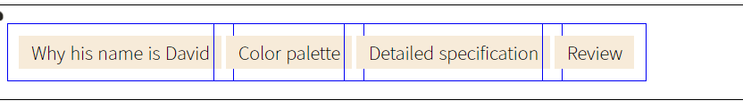
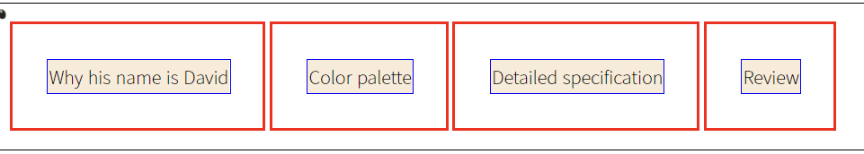

## 메뉴 가운데 정렬하기
---
상단에 위치하는 navigation을 `float:left;`를 이용해 정렬해두었는데, 이 위치는 내가 디자인한 것과는 거리가 있었다.  
나는 네비게이션 메뉴를 가운데 오도록 디자인하고 싶다.  
일반적으로 메뉴를 정렬하는 방법은, `float`를 속성으로 준 후 상위 element에 witdth와 margin속성을 주어 중앙에 위치시키는 것이 많이 이용되었다.  
이 방법은 메뉴의 갯수가 수정되는 경우 전체 가로 너비를 다시 지정해줘야 하는 문제가 발생할 수 있다.  
그래서 나는 또ㅋㅋㅋㅠ`display: inline-block;`을 쓰는 쪽으로 마음이 기울고 말았다.ㅎ (git branch는 아직 어려워서 못하겠어요 멘토님)

<br>
<br>
<br>

## [`backgroud-clip`](https://www.w3schools.com/cssref/css3_pr_background-clip.asp)과 `border`이용하여 디자인 효율 높이기
---
콘텐츠의 부피감을 확인해서 적절한 레이아웃을 만든 후 최종 디자인을 만드는 방향으로 진행하고 있다.

### [`backgroud-clip`](https://www.w3schools.com/cssref/css3_pr_background-clip.asp)
background-color나 backgroud-image의 값을 박스의 어디에 넣을지 정하는 속성이다.
- border-box : 테두리와 그 안쪽을 채운다
- padding-box : 테두리 안쪽을 (콘텐츠와 여백)을 채운다. (태두리는 포함 안됨)
- content-box : 콘텐츠 안쪽을 채운다
- initial : 기본값으로 설정한다(border-box)
- inherit : 부모요소의 값과 동일하게 한다. 

### [`border`](https://www.w3schools.com/cssref/pr_border.asp)
syntax자체는 **굵기(width), 스타일(style), 색상(color)**순으로 적게 되어있는데, 순서가 바뀐다고 해서 적용이 안되는 것은 아니다.
- border-width
    - px
    - medium/thick/thin
    - length
    - initial(medium)
    - inherit
- border-style
    - initial: none
    - none : 선이 없고, **가장 낮은 순위를 가진다**
    - hidden : none과 같이 선이 없지만, **가장 높은 순위를 가져** 주변 칸이 실선을 같더라도 우선순위를 가진다.
    - inherit : 부모의 값을 따른다.
    - solid : 실선
    - dashed : 여러개의 끊어진 직선으로 그려진다.
    - dotted : 둥근 점 여러개로 그린다. 점의 반지름은 border-width의 1/2이다.
    - double : 두개의 평행한 실선
    - groove : 테두리가 파인 것처럼 그려진다. ridge의 반대
    - ridge : 테두리가 튀어나온 것처럼 그려진다. groove의 반대
    - inset : 콘텐츠가 파인 것처럼 그려진다. outset의 반대. 
    - outset : 콘텐츠가 튀어나온 것처럼 그려진다. inset의 반대.
- 특정 방향에 대해 설정할 수도 있다
    - border-top
    - border-bottom
    - border-left
    - border-right

<br>
<br>

## `float`를 이용해 정렬한 `<li>`가 겹쳐지는 현상 해결
---



개별적인 페이지를 디자인하던 도중, 위와같은 문제가 발생했다.  
style 코드는 다음과 같다.

```html
<style>
            #logo {
                float: left;
            }
            #mainNav {
                height: 100%;
                width: 100% ;
                border: 1px solid black; /*디자인 검토용*/
            }
            #mainNav ul li {
                display: inline-block; /*가로정렬*/
                list-style: none;
                line-height: 30px;
                vertical-align: middle;
                text-align: center;
            }
            #mainNav .menuLink {
                color: black;
                text-decoration: none;
                display: block;
                width: 100%;
                padding: 10px;
                background-color: antiquewhite; /*이후수정*/
                border: 1px solid blue; /*디자인 검토용*/
                background-clip : content-box; /*디자인 검토용*/
            }
        </style>
        <!-- style로 연결 -->
        <link rel="stylesheet" href="style.css">
```

blue border가 겹쳐있으므로, `#mainNav .menuLink` 즉 `<a>`에 문제가 있는걸까?



```html
<style>
            #logo {
                float: left;
            }
            #mainNav {
                height: 100%;
                width: 100% ;
                border: 1px solid black; /*디자인 검토용*/
            }
            #mainNav ul li {
                display: inline-block; /*가로정렬*/
                padding: 30px;
                border: solid 3px red;
                list-style: none;
                line-height: 30px;
                vertical-align: middle;
                text-align: center;
            }
            #mainNav .menuLink {
                color: black;
                text-decoration: none;
                display: block;
                width: 100%;
                /* padding: inherit; */
                background-color: antiquewhite; /*이후수정*/
                background-clip : content-box; /*디자인 검토용*/
                border: 1px solid blue; /*디자인 검토용*/
            }
        </style>
```

a에 준 padding을 없애고 li에 padding과 red border를 입힌 모습이다.  
그런데 이 경우는, 메뉴 글자가 아닌 언저리(바탕)을 클릭한 경우에는 연결이 안되는 문제점이 있다.  방법이 있을텐데..
